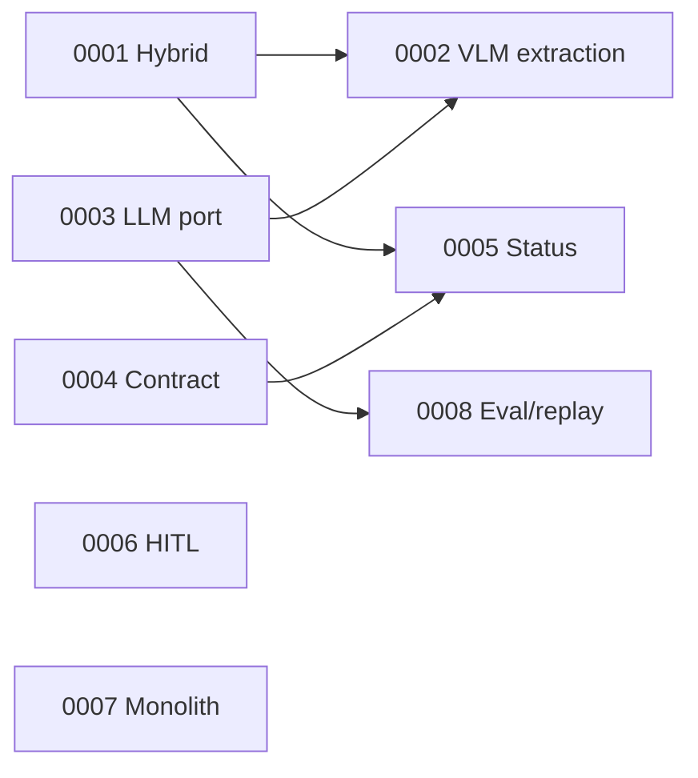

# Architecture Decision Records

← [docs index](../README.md) · Template: [template.md](template.md)

| ADR | Title | Status | Relations |
|---|---|---|---|
| [0001](0001-hybrid-validation-architecture.md) | Hybrid validation: deterministic rules + LLM for perception | Accepted | enables 0002, 0005 |
| [0002](0002-multimodal-llm-extraction.md) | Multimodal-LLM extraction with bboxes; OCR cross-check in prod | Accepted | depends on 0001, 0003 |
| [0003](0003-provider-agnostic-llm-port.md) | Provider-agnostic LLM port; Gemini 3.5-flash + fallback chain | Accepted | enables 0002, 0008 |
| [0004](0004-canonical-contract.md) | Canonical Offer/Finding contract as the integration boundary | Accepted | enables parallel build |
| [0005](0005-finding-status-semantics.md) | Five-state status; severity ⟂ confidence | Accepted | complements 0004 |
| [0006](0006-human-in-the-loop.md) | Decision support, human approves publication | Accepted | — |
| [0007](0007-modular-monolith-serverless.md) | Modular monolith; serverless container in prod | Accepted | — |
| [0008](0008-evaluation-gated-replay.md) | Golden set + LLM record/replay gate every change | Accepted | depends on 0003 |

Lifecycle: Proposed → Accepted → (Deprecated | Superseded). Don't rewrite accepted ADRs; write a new one.
