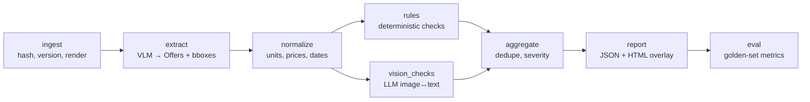

# Components (C4 Level 3)

← [architecture](README.md) · [docs index](../README.md)

## Pipeline

## Module map (`src/flyercheck/`)

| Module | Responsibility | Port / contract | Capability | Design |
|---|---|---|---|---|
| `domain/` | Pydantic models: `Document`, `Page`, `BBox`, `Offer`, `Finding`, `RunResult`, enums | — (it *is* the contract) | C-04/06/10 | [domain-model](../domain/domain-model.md) |
| `ingest/` | Validate the file, SHA-256, PyMuPDF render at 200 dpi, `Page` records | `render(pdf) -> list[Page]` | C-01, C-02 | [pipeline](../design/pipeline.md#1-ingest) |
| `llm/` | Provider adapters (Gemini, Azure OpenAI), `replay`/`record`/`live` modes, JSON-schema output | `LLMPort.generate(prompt, images, schema) -> dict` | C-09 | [ADR-0003](../adr/0003-provider-agnostic-llm-port.md) |
| `extract/` | Prompt + schema to get offers with raw strings and bboxes per field | `extract(pages, llm) -> list[Offer]` | C-03, C-04, C-05 | [pipeline](../design/pipeline.md#2-extract) |
| `normalize/` | Parse "1,69" → `Decimal`, "6 x 1,5 l" → 9 l, "8 x 150 Blatt" → 1200 sheets, dates | pure functions | C-06 | [pipeline](../design/pipeline.md#3-normalize) |
| `rules/` | Rule registry + rules R-01…R-08 | `Rule.check(offer, ctx) -> list[Finding]` | C-08 | [rules-catalog](../design/rules-catalog.md) |
| `vision_checks/` | Crop the offer image, ask the LLM "does it match the text?", return structured verdict | `VisionCheck.check(offer, page_img, llm)` | C-09 | [pipeline](../design/pipeline.md#5-vision-checks) |
| `reference/` | Stub port for PIM/price data (`NullReference` → `not_evaluable`) | `ReferencePort.lookup(offer)` | C-07 | — |
| `aggregate/` | Dedupe, apply severity policy, sort | `aggregate(findings) -> list[Finding]` | C-10 | [pipeline](../design/pipeline.md#6-aggregate) |
| `report/` | `findings.json` + self-contained `report.html` (page image + SVG bboxes + table) | `render_report(run) -> Path` | C-11, C-12 | [api](../api/README.md) |
| `eval/` | Compare `findings.json` to `data/golden/*.json` → P/R/F1 per category | `evaluate(run, golden)` | C-14 | [evaluation](../operations/evaluation-and-monitoring.md) |
| `cli.py` / `pipeline.py` | Orchestrate the run, set the run id, record versions | — | C-13, C-15 | — |

## Traceability

| Requirement | Module | Test |
|---|---|---|
| FR-01/02 ingest, render | ingest | `test_ingest.py` |
| FR-03/04/05 extract offers + regions | extract, llm | `test_extract_replay.py` |
| FR-06 raw + normalized | domain, normalize | `test_normalize.py` |
| FR-07 price, unit price, discount, date | rules | `test_rules.py` (golden cases G-01…G-08) |
| FR-08 image↔text | vision_checks | `test_vision_replay.py` |
| FR-10 completeness (Grundpreis) | rules R-04 | `test_rules.py` |
| FR-11 cross-page | rules R-07 | `test_rules.py` |
| FR-12/13 structured findings, status | domain, aggregate | `test_contract.py` |
| FR-15 versions | pipeline | `test_pipeline.py` |
| FR-18 evaluation | eval | `test_eval.py` |
