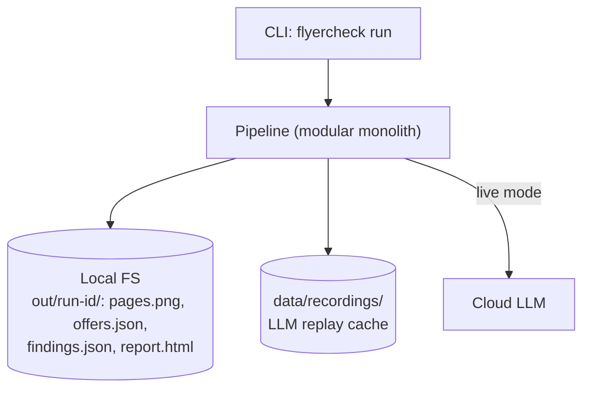
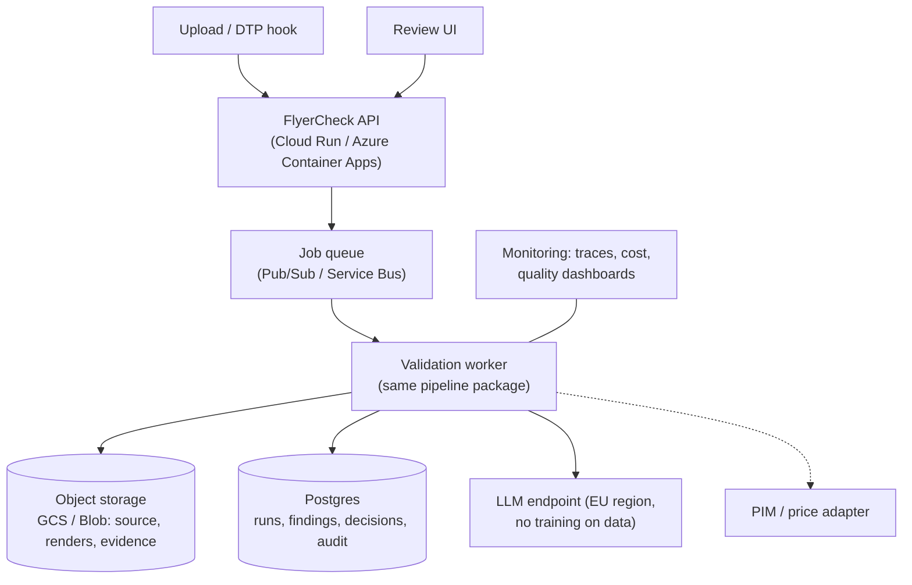

# System Context & Containers

← [architecture](README.md) · [docs index](../README.md)

## C4 Level 1 — System context

```mermaid
flowchart LR
    DTP["Flyer production<br/>(DTP / agency)"] -->|flyer PDF + campaign metadata| FC
    REV["QA reviewer"] <-->|findings, decisions| FC
    FC["FlyerCheck<br/>AI consistency validation"]
    FC -->|multimodal prompts| LLM["Cloud LLM<br/>Gemini (Vertex AI) / Azure OpenAI"]
    FC -.->|lookup (target)| PIM["PIM / price & campaign DB"]
    FC -.->|optional OCR cross-check| OCR["Document AI / Azure Document Intelligence"]
    FC -->|approved report| PUB["Existing publication approval"]
```

## C4 Level 2 — Containers

### PoC (this sprint)
One Python package with a CLI. Everything runs in-process; output is files.



### Target (production, same code)

Rationale: [ADR-0007](../adr/0007-modular-monolith-serverless.md). Deployment details: [operations/deployment.md](../operations/deployment.md).
