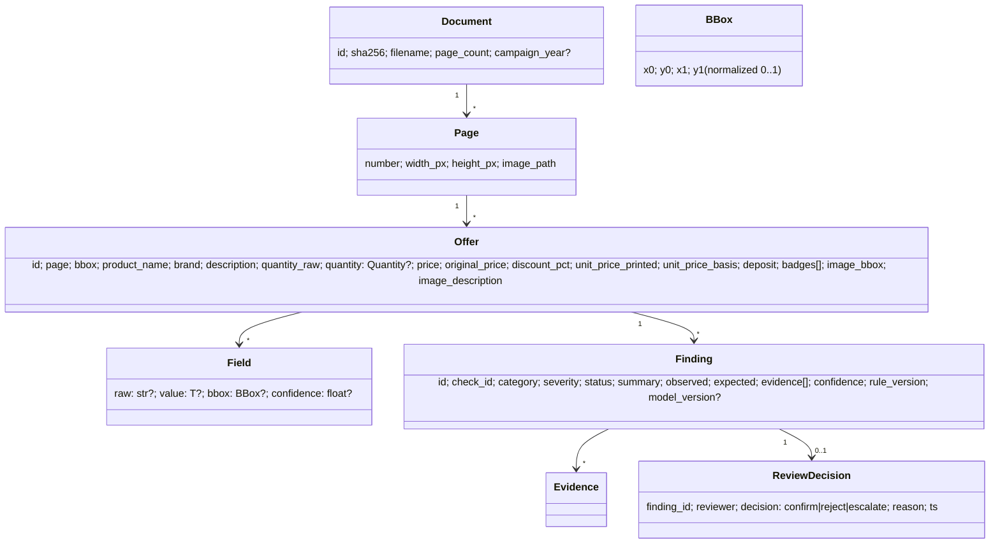

# Domain Model — Canonical Contract (v1)

← [domain](README.md) · [docs index](../README.md) · ADR: [0004](../adr/0004-canonical-contract.md), [0005](../adr/0005-finding-status-semantics.md)

Implemented in `src/flyercheck/domain/models.py` (pydantic v2). Frozen during parallel work. Observation, validation and decision are kept apart.

## Entities

- **`Field[T]`** holds the `raw` OCR string, the parsed `value`, a `bbox` and an extraction `confidence`. A missing value is `None`, never a default.
- **`Quantity`**: `{amount: Decimal, unit: g|kg|ml|l|piece|sheet, pack_count: int=1}`; `total()` gives the base unit.
- Money is `Decimal`, currency EUR. Never `float`.
- **`DocumentContext`**: `{document, pages, offers, campaign: {valid_from, valid_until, weekday_labels, year?}, page_refs: [{text, target_page, bbox}]}`, for document-level rules.

## Enums

| Enum | Values |
|---|---|
| `Status` | `pass`, `fail`, `needs_review`, `not_evaluable`, `error` |
| `Severity` | `critical` (legal/price), `high`, `medium`, `low`, `info` |
| `Category` | `E01_product_image` … `E10_visual_quality` (see below) |

## Error taxonomy

| ID | Category | PoC check | Method |
|---|---|---|---|
| E-01 | Product ↔ image consistency | V-01 | LLM vision |
| E-02 | Price vs. master data | R-08 | Reference port (stub → `not_evaluable`) |
| E-03 | Arithmetic (unit price, discount) | R-01, R-02 | Deterministic |
| E-04 | Quantity / unit | R-01 via normalize | Deterministic |
| E-05 | Spatial association | extract confidence → `needs_review` | VLM + geometry |
| E-06 | Temporal / campaign | R-05 | Deterministic |
| E-07 | Semantic claims | V-02 (optional) | LLM, only with references |
| E-08 | Completeness (Grundpreis, deposit) | R-03, R-04 | Deterministic |
| E-09 | Cross-page references | R-07 | Deterministic |
| E-10 | Visual quality | — (prod) | CV / OCR |

## Status semantics ([ADR-0005](../adr/0005-finding-status-semantics.md))

| Status | Meaning | Example |
|---|---|---|
| `pass` | The check ran on reliable inputs; the condition holds | Coffee 6.99/500 g = 13.98 €/kg ✓ |
| `fail` | The check ran on reliable inputs; the condition is violated | Pizza 5.59 printed vs. 5.28 |
| `needs_review` | It ran, but the evidence is ambiguous or low-confidence | Weekday labels depend on the unknown year |
| `not_evaluable` | A required input or reference is missing | No PIM to verify the price |
| `error` | Technical failure (timeout, parse error) | LLM returned invalid JSON twice |

Severity is business impact. Confidence is evidence strength. They are never merged into one score.
