# Implementation Plan — Parallel Build with Git Worktrees

← [docs index](../README.md) · Presentation: [presentation.md](presentation.md)

> **Superseded in detail by** [.docs/adhoc/flyercheck-poc/](../../.docs/adhoc/flyercheck-poc/flyercheck-poc-plan.md) (executable plan with code, fixtures, agent prompts). This page stays as the overview.

**Budget:** 30 min coding + 10 min presentation. **Strategy:** freeze the contract first, then fan out to 5 agents in isolated worktrees that code against **fixtures**, then integrate with a single wiring step. This only works because of [ADR-0004](../adr/0004-canonical-contract.md) and [ADR-0008](../adr/0008-evaluation-gated-replay.md).

```mermaid
gantt
    dateFormat mm
    axisFormat %M'
    section Wave 0 (integrator)
    Scaffold + contract + fixtures + commit :w0, 00, 7m
    section Wave 1 (5 agents in parallel)
    wt-llm      (adapters, record/replay) :a1, after w0, 13m
    wt-extract  (ingest, extract, normalize) :a2, after w0, 13m
    wt-rules    (R-01..R-08, aggregate)   :a3, after w0, 13m
    wt-vision   (V-01)                    :a4, after w0, 11m
    wt-report   (report HTML, eval)       :a5, after w0, 11m
    section Wave 2 (integrator)
    Merge + pipeline/CLI + record + eval :w2, after a1, 8m
    section Wave 3
    Buffer / slides                       :w3, after w2, 2m
```



Critical path: **Wave 0 → wt-llm + wt-extract → live record on Designer.pdf**. Everything else can be demoed from fixtures even if extraction slips.

---

## Pre-flight (before the clock starts)
- [ ] `Designer.pdf` copied to `data/samples/Designer.pdf`
- [ ] LLM credentials work (**decide ADR-0003**): `gcloud auth application-default login` + `GOOGLE_CLOUD_PROJECT`, `GOOGLE_CLOUD_LOCATION=europe-west3`, **or** `AZURE_OPENAI_ENDPOINT`/`AZURE_OPENAI_API_KEY`/deployment name
- [ ] `uv`, Python 3.12, git available
- [ ] Smoke test: one live call returns JSON

## Wave 0 — Contract freeze (integrator = main session, ~7 min, sequential)

| Step | Output |
|---|---|
| 0.1 | `git init`, `.gitignore` (out/, .venv, .env) |
| 0.2 | `uv init --package flyercheck`; **all** deps declared now (no pyproject edits in Wave 1): `pydantic pymupdf pillow jinja2 typer pyyaml google-genai openai` + dev `pytest ruff` |
| 0.3 | Package skeleton: every module dir with an empty `__init__.py` (see ownership) |
| 0.4 | `domain/models.py`: `BBox, Field, Quantity, Offer, Page, Document, DocumentContext, Finding, Evidence, Status, Severity, Category, RunResult` per [domain-model](../domain/domain-model.md) |
| 0.5 | `llm/port.py`: `class LLMPort(Protocol): def generate(self, prompt: str, images: list[bytes], schema: dict, *, model: str) -> dict` + `FakeLLM(responses: dict)` for tests |
| 0.6 | `rules/base.py`: `Rule` protocol + `@register` + `REGISTRY` · `vision_checks/base.py`: `VisionCheck` protocol |
| 0.7 | `tests/fixtures/designer_context.json`: **hand-built `DocumentContext`** with the 9 offers from the [sample analysis](../domain/sample-flyer-analysis.md) (approximate bboxes, 1 page, page_refs=[Seite 6]) + `tests/fixtures/page1.png` |
| 0.8 | `data/golden/designer.json`: G-01…G-10 + expected passes |
| 0.9 | `uv run pytest` green (contract round-trip test) → `git commit -m "wave0: contract"` |

## Wave 1 — Parallel worktrees (5 agents, ~11–13 min)

### File ownership
Each agent writes **only** to its own paths. `domain/`, `pyproject.toml`, `cli.py` and `pipeline.py` are read-only for all of them, so merges cannot conflict.

| Worktree / branch | Owns | Reads | Done when |
|---|---|---|---|
| `wt-llm` / `feat/llm` | `src/flyercheck/llm/{gemini.py,azure.py,recording.py,factory.py}`, `tests/test_llm_*.py` | `llm/port.py` | `RecordingLLM(inner, mode)` stores and replays by hash; both adapters return dicts in JSON-schema mode; bbox normalization helper (0–1000 → 0–1); tests offline |
| `wt-extract` / `feat/extract` | `ingest/`, `extract/`, `normalize/`, `tests/test_ingest.py`, `tests/test_normalize.py`, `tests/test_extract.py` | domain, `llm/port.py` | `render(pdf)→Pages`; prompt + `ExtractedPage` schema; `extract(pages, llm)→DocumentContext`; normalize parses every quantity/price/unit-price/validity string in the fixture; test with `FakeLLM` |
| `wt-rules` / `feat/rules` | `rules/r_*.py`, `rules/config.yaml`, `aggregate/`, `tests/test_rules.py`, `tests/test_aggregate.py` | domain, fixture | On `designer_context.json`, R-01…R-08 + R-02b reproduce G-02…G-10 exactly and the expected passes |
| `wt-vision` / `feat/vision` | `vision_checks/v01_image_text.py`, `vision_checks/prompts.py`, `tests/test_vision.py` | domain, `llm/port.py`, fixture png | Crop by bbox, two-step prompt (blind describe → compare), status mapping; test with `FakeLLM` covering yes/no/unclear |
| `wt-report` / `feat/report` | `report/` (Jinja template, `render.py`), `eval/`, `tests/test_report.py`, `tests/test_eval.py` | domain, golden, fixture | Self-contained `report.html` with SVG bbox overlay, status summary and table; `evaluate(findings, golden)` → per-category P/R/F1 table (stdout + JSON) |

### Launching
**Option A: Claude Code subagents (preferred).** From the main session, spawn 5 `Agent` calls in **one message** with `isolation: "worktree"` and `run_in_background: true`. Each gets the prompt template below.

**Option B: manual terminals.**
```bash
for b in llm extract rules vision report; do
  git worktree add ../fc-$b -b feat/$b
done
# one terminal per worktree:
cd ../fc-rules && claude "$(cat docs/plan/prompts/rules.md)"
```

### Agent prompt template
```
You are implementing <MODULE> of FlyerCheck in an isolated git worktree.
Read first: CLAUDE.md, docs/README.md, docs/domain/domain-model.md, <DESIGN DOC>, <ADRs>.
You OWN only: <PATHS>. Do NOT modify src/flyercheck/domain/, pyproject.toml, cli.py, pipeline.py
or any other module. If the contract is insufficient, stop and report the needed change.
Build against tests/fixtures/designer_context.json and FakeLLM; no network in tests.
Definition of done: <DONE WHEN>; `uv run pytest tests/<your tests> -q` green; `uv run ruff check <paths>` clean.
Commit on your branch with message "feat(<module>): ...". Report: files changed, test results, open issues.
```

## Wave 2 — Integration (integrator, ~8 min)
1. Merge in dependency order: `feat/llm` → `feat/rules` → `feat/report` → `feat/vision` → `feat/extract` (all fast-forward or trivial; ownership is disjoint).
2. Write `pipeline.py` (ingest → extract → rules ∥ vision → aggregate → report; records versions and cost) and `cli.py` (`run`, `eval`).
3. `flyercheck run data/samples/Designer.pdf --mode record --year 2026` → commit `data/recordings/`.
4. `flyercheck eval` → keep the P/R table for the slides.
5. `--mode replay` run = the **demo safety net** (works offline).
6. Fallback if extraction is weak: run rules/vision/report on `designer_context.json` (`--from-context`) and present extraction quality as a known gap.

## Wave 3 — Buffer
Screenshot the report, paste the eval table into [presentation.md](presentation.md), tag `v0.1-poc`.

## Risks to the plan
| Risk | Mitigation |
|---|---|
| Credentials fail on the day | Pre-flight smoke test; fixture-driven demo path (6.) |
| Agents edit shared files | Ownership table + read-only rule in CLAUDE.md; integrator rejects off-scope diffs |
| Contract gap found mid-wave | Agent stops and reports; integrator patches `domain/` on `main`, agents `git rebase main` |
| VLM bbox quality poor | The report still shows evidence values; bbox is drawn as "approximate" |
