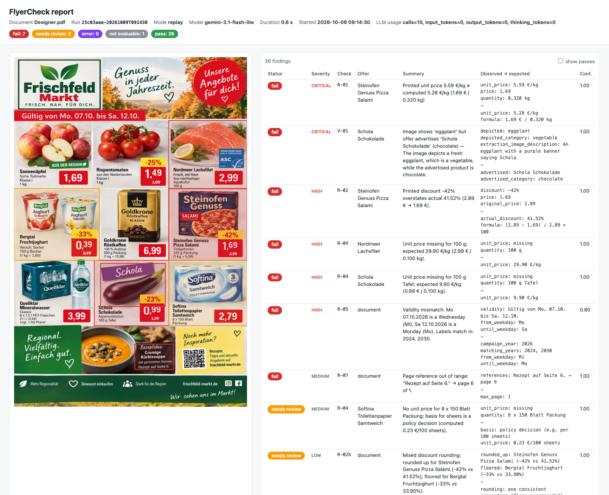

# Presentation — 10 minutes (+ Q&A)

← [plan](implementation-plan.md) · [docs index](../README.md)

Structured around the three questions in the brief.

| Min | Slide | Message | Source |
|---|---|---|---|
| 0:00 | 1. Problem & assumptions | Weekly flyers, manual review, confidential prices; assumptions A-01…A-05 | [vision](../vision/README.md) |
| 1:00 | 2. **Q1 Target architecture** | Hybrid: the LLM *perceives*, code *verifies*, the human *decides*. Show the pipeline diagram | [ADR-0001](../adr/0001-hybrid-validation-architecture.md), [components](../architecture/components.md) |
| 2:30 | 3. Cloud & model choice | Provider port; Gemini on Vertex EU (grounding) vs. Azure OpenAI; same code | [ADR-0003](../adr/0003-provider-agnostic-llm-port.md), [system-context](../architecture/system-context.md) |
| 3:30 | 4. **Live demo** | `flyercheck run Designer.pdf` → report: aubergine/chocolate, pizza unit price 5.59 vs. 5.28, −42 % overstated, missing Grundpreis ×3, Mo/Sa vs. year, "Seite 6" | [sample analysis](../domain/sample-flyer-analysis.md) |
| 6:00 | 5. **Q2 Implementation, deployment, documentation** | Rules catalog, contract + ADRs, golden-set gate, Cloud Run / Container Apps, docs-as-code | [rules](../design/rules-catalog.md), [deployment](../operations/deployment.md), [eval](../operations/evaluation-and-monitoring.md) |
| 8:00 | 6. **Q3 Risks & limits** | Misreads, grouping, false safety, no master data, data privacy, drift → mitigations | [risks](../operations/risks.md) |
| 9:00 | 7. Roadmap | PoC → shadow pilot (baseline) → assisted production → PIM integration | [vision](../vision/README.md#roadmap) |

**Talking points:** "No findings ≠ defect-free" · "Every finding has evidence you can verify in 5 seconds" · "How the work was built: contract first, 5 agents in parallel worktrees"

## PoC results (2026-10-09, `v0.1-poc`)



```
$ flyercheck run data/samples/Designer.pdf --mode replay
✔ 9 offers · 7 fail · 2 needs_review · 1 not_evaluable · 26 pass   (replay, 0.6s)

$ flyercheck eval out/<run>/findings.json data/golden/designer.json
category                 TP   FP   FN precision  recall
E01_product_image         1    0    0      1.00    1.00
E03_arithmetic            3    0    0      1.00    1.00
E06_temporal              1    0    0      1.00    1.00
E08_completeness          3    0    0      1.00    1.00
E09_cross_reference       1    0    0      1.00    1.00
overall                   9    0    0      1.00    1.00
status_agreement 1.00 · expected_pass_agreement 1.00
```

| Live run (record) | Value |
|---|---|
| Extraction | `gemini-3.5-flash`, ~16–34 s (429/503 retries), 9/9 offers exact |
| V-01 (9 crops, 3 parallel) | ~35 s; fallback to `gemini-3.1-flash-lite` on 429 shows the fallback chain working |
| Tokens (10 calls) | 29.7k in · 5.1k out · 4.7k thinking → fractions of a cent per page |
| Replay | 0.6 s, offline, deterministic |
| Tests | 116 passing, offline |

**Caveat to state:** one synthetic flyer = a functional test, not an accuracy claim (see risks R10). Next: mutation-based golden set (E2).

**How it was built:** Phase 0 contract (~7 min) → 5 agents in parallel git worktrees (≈1.5–4 min each, 0 merge conflicts) → integrate + record + eval.
